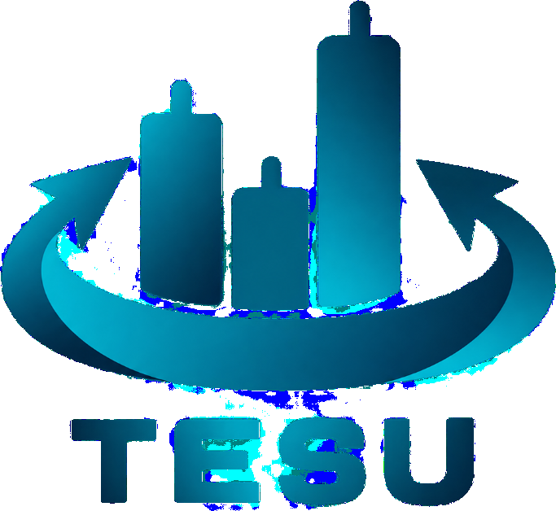
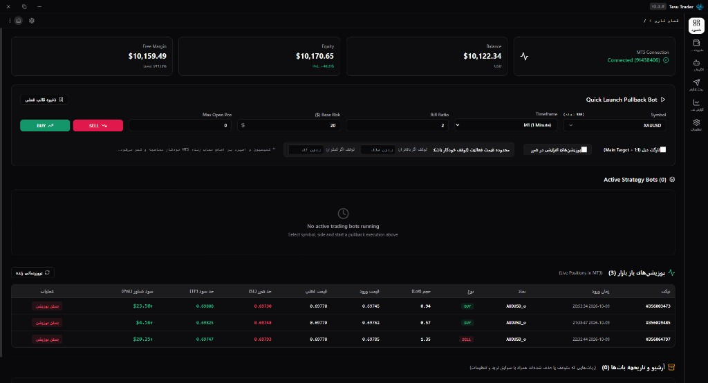
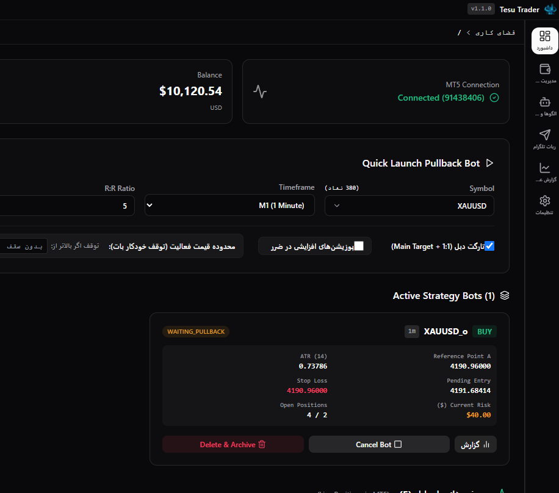
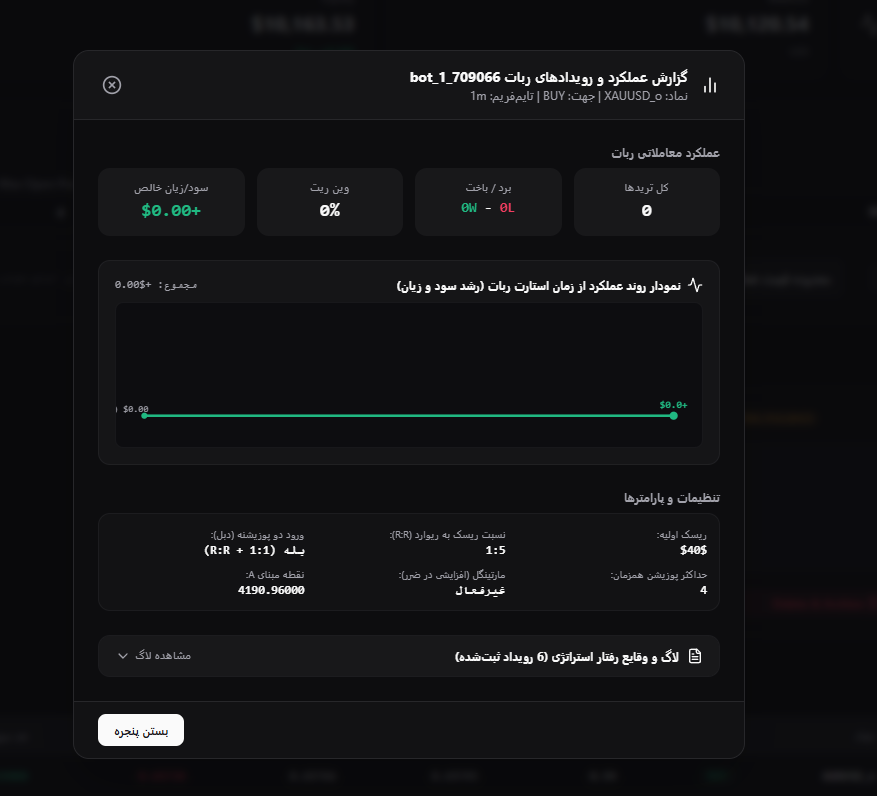
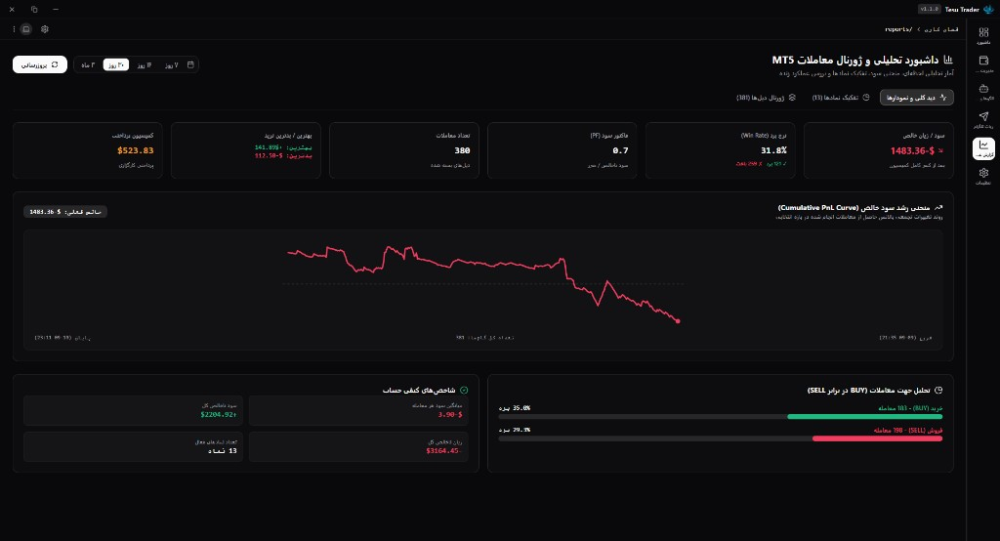
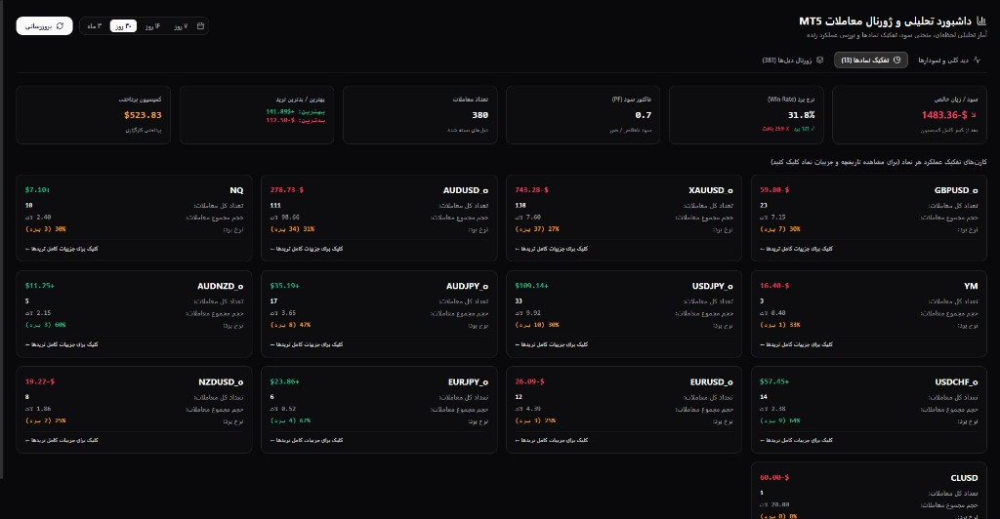
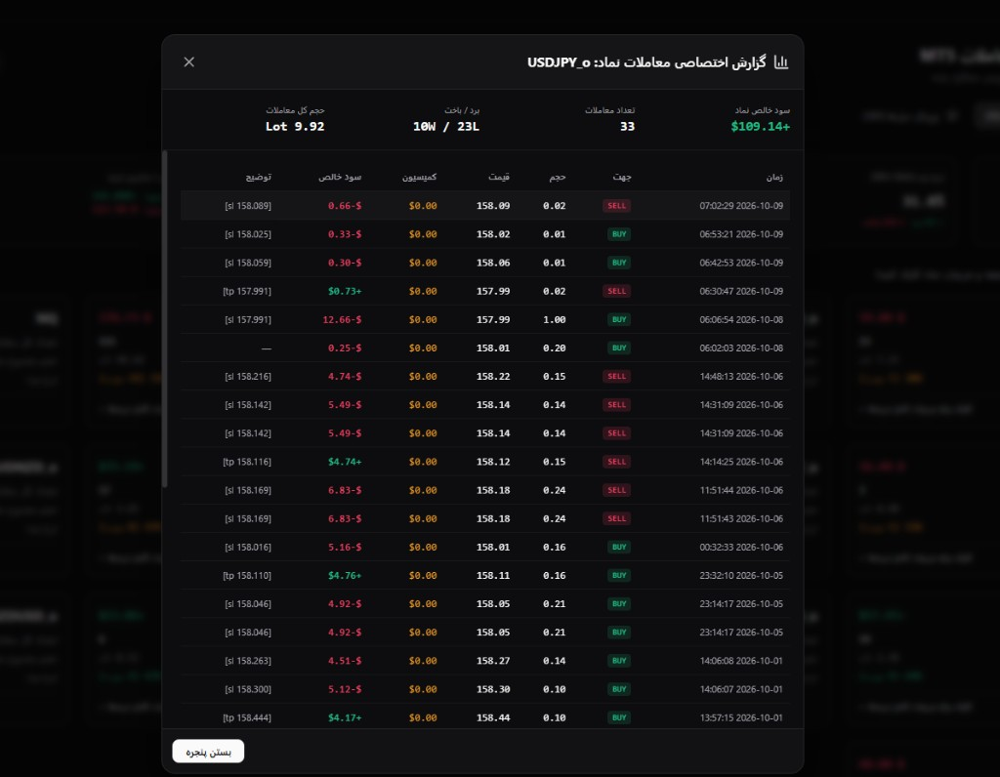

<div align="center">



# Tesu Trader (تسو تریدر)
### سامانه معاملاتی خودکار و الگوریتمی متاتریدر ۵ مبتنی بر متدولوژی پولبک استاپ-انتری

[](https://github.com/Nitron-Pro/tesu/releases/tag/v1.0.0)
[](https://github.com/Nitron-Pro/nora)
[](https://github.com/Nitron-Pro/tesu/releases)
[](https://www.metatrader5.com)
[](#)

<p align="center">
  <b>Tesu Trader</b> یک پلتفرم معاملاتی مدرن دسکتاپ بر پایه فریم‌ورک قدرتمند <b><a href="https://github.com/Nitron-Pro/nora">نورا (Nora)</a></b> (ترکیب Tauri 2.0، Rust و React) است که با اتصال فوق‌سریع به پایتون و پروتکل مستقیم MetaTrader 5، استراتژی‌های پیوسته معاملاتی پولبک را بدون دخالت دست، با مدیریت ریسک دقیق و محاسبات خودکار لات اجرا می‌کند.
</p>

[دانلود آخرین نسخه (v1.0.0)](https://github.com/Nitron-Pro/tesu/releases/tag/v1.0.0) • [مستندات معماری](docs/ARCHITECTURE.md) • [گزارش نسخه](docs/ROADMAP.md)

---

</div>

## 📸 گالری محیط نرم‌افزار (Screenshots)

### ۱. داشبورد اصلی معاملات و مانیتورینگ زنده بازار
نمایش لحظه‌ای متریک‌های حساب (Balance, Equity, Free Margin, Floating PnL)، فرم اجرای سریع استراتژی پولبک و جدول پوزیشن‌های باز جاری در بازار:
<p align="center">
  
</p>

---

### ۲. کارت اختصاصی ربات‌های فعال با محاسبه آنی سطوح ورود
رهگیری نقطه مبنای A، اندیکاتور ATR(14)، قیمت سفارش معلق (Pending Entry)، حد ضرر (Stop Loss) و وضعیت لحظه‌ای ترید:
<p align="center">
  
</p>

---

### ۳. کارنامه و نمودار رشد اختصاصی هر ربات (Bot Audit & Performance Curve)
نمودار رشد سرمایه و عملکرد دلاری از لحظه استارت ربات (شروع از نقطه صفر)، جدول ریز دیل‌های بسته شده و لاگ آکاردئونی رویدادهای رفتار استراتژی:
<p align="center">
  
</p>

---

### ۴. داشبورد تحلیلی و ژورنال کامل معاملات حساب (MT5 Reports)
محاسبه حرفه‌ای فاکتور سود (Profit Factor)، وین‌ریت (Win Rate)، منحنی برآیند حساب (Cumulative Equity Curve) و مقایسه آماری تریدهای BUY در برابر SELL:
<p align="center">
  
</p>

---

### ۵. تحلیل تفکیکی نمادها و ژورنال کامل دیل‌ها
کارت‌های عملکرد هر جفت‌ارز و مودال بازشو برای تحلیل اختصاصی سود، حجم و تیکت‌های هر نماد:
<p align="center">
  
  
</p>

---

## ⚡ قابلیت‌های کلیدی (Key Features)

- **هسته دسکتاپ بر پایه [Nora Boilerplate](https://github.com/Nitron-Pro/nora):**
  - فریم‌ورک فوق‌سبک و امن **Tauri 2.0** + **Rust**.
  - طراحی فریم‌لس ویندوز ۱۱ با پنجره سفارشی `CustomTitlebar`.
  - حافظه مصرفی بسیار ناچیز در مقایسه با الکترون (< 40MB RAM).
  - ذخیره‌سازی داده‌ها به صورت کاملاً پرتابل (Portable) بدون ردپا در درایو ویندوز.
- **راه‌اندازی خودکار و بدون پنجره موتور پایتون:**
  - نرم‌افزار به محض باز شدن، اسکریپت `engine/main.py` را در پس‌زمینه و بدون پنجره سیاه اجرا کرده و پل ارتباطی وب‌سوکت با متاتریدر ۵ را فعال می‌سازد.
- **استراتژی پولبک استاپ-انتری (Pullback Stop-Entry):**
  - تشخیص خودکار کف و سقف پیوت بر مبنای کندل‌ها و ست کردن نقطه A.
  - ثبت سفارش‌های معلق Buy Stop و Sell Stop و جابجایی تریل در شکست‌های جدید.
  - ابطال هوشمند با رصد ۵ برابر ATR و محاسبه دقیق اسپرد لایو بروکر.
- **ورود دو پوزیشنه (Double Position 1:1 + R:R):**
  - ورود همزمان با دو پوزیشن: پوزیشن اول با تارگت ۱:۱ برای پوشش کمیسیون و ریسک‌فری سریع و پوزیشن دوم با تارگت اصلی R:R.
- **محاسبه دقیق حجم بر اساس ریسک دلاری (Lot Sizing Engine):**
  - فرمول دقیق: $\text{Lots} = \frac{\text{Risk USD}}{\text{Loss Per Lot} + \text{Commission Per Lot}}$
- **مدیریت پیشرفته ریسک و مارتینگل پلکانی:**
  - افزایش پلکانی درصد ریسک پس از ضرر متوالی و ریست شدن فوری پس از تاچ تارگت.
  - سقف پوزیشن باز همزمان (`Max Open Positions`) برای محافظت از مارجین حساب.
  - محدوده سقف و کف قیمت برای توقف خودکار ربات در نقاط حمایتی/مقاومتی.
- **سیستم قالب‌ها و ربات تلگرام (Presets & Telegram Bot):**
  - ذخیره الگوهای شخصی با کد یکتا (مانند `P1`, `GOLD30`) و امکان اجرای استراتژی از راه دور با دستورات `/run`, `/status`, `/presets`.
- **سیستم آرشیو و تاریخچه بات‌ها:**
  - جلوگیری از پاک شدن سوابق عملکرد ربات‌ها پس از حذف و ثبت در بخش آرشیو.

---

## 🏗️ ساختار پروژه (Architecture)

پروژه از قانون تفکیک هسته و برنامه چارچوب **نورا (Nora)** پیروی می‌کند:

```text
tesu/
├── src/
│   ├── app/                # کدهای اختصاصی تسو تریدر (داشبورد، استورها، گزارشات، پریست‌ها)
│   │   ├── pages/          # صفحات اصلی (TraderDashboard, ReportsPage, ...)
│   │   ├── store/          # مدیریت وضعیت ترید و وب‌سوکت با Zustand
│   │   └── config.ts       # شناسنامه و منوهای تسو
│   └── core/               # هسته زیرساختی نورا (سرویس‌ها، تایتل‌بار، ترای، تم، i18n)
├── src-tauri/              # بک‌اند Rust برای توری ۲ (پرینتر، سریال، اجرای پروسه پایتون)
├── engine/                 # موتور الگوریتمی پایتون متصل به MT5
│   ├── main.py             # سرور وب‌سوکت محلی ws://127.0.0.1:9182
│   ├── mt5_bridge.py       # رابط مستقیم با توابع MetaTrader 5
│   ├── pullback_engine.py  # منطق و ماشین حالت استراتژی پولبک
│   └── telegram_bot.py     # کنترل‌کننده دستورات تلگرام
└── build_output/           # فایل‌های اجرایی کامپایل‌شده و نصبی ویندوز
```

---

## 🚀 راهنمای نصب و راه‌اندازی

### پیش‌نیازها
1. سیستم عامل ویندوز ۱۰ یا ۱۱ (۶۴ بیتی).
2. نرم‌افزار متاتریدر ۵ باز و لاگین‌شده با حساب معاملاتی مورد نظر (قابلیت **Algo Trading** باید در MT5 فعال باشد).
3. پایتون نسخه 3.10 به بالا با پکیج‌های پیش‌نیاز:
   ```powershell
   pip install -r engine/requirements.txt
   ```

### اجرای مستقیم از فایل نصبی / پرتابل
شما می‌توانید آخرین نسخه کامپایل‌شده را مستقیماً از بخش **[Releases](https://github.com/Nitron-Pro/tesu/releases)** دانلود و استفاده کنید:
- **`Tesu_Trader.exe`**: نسخه بدون نیاز به نصب (Portable).
- **`Tesu_Trader_1.1.0_Setup.exe`**: اینستالر خودکار با ساخت شرتکات دسکتاپ و موتور بدون وابستگی (Standalone).

### اجرای محیط توسعه (Development)
```powershell
# ۱. نصب وابستگی‌های فرانت‌اند
npm install

# ۲. اجرای همزمان هسته و رابط کاربری
npm run tauri dev
```

---

## 🔗 ارجاعات و اعتبارنامه (Credits)

- توسعه‌یافته بر پایه **[Nora Desktop Boilerplate](https://github.com/Nitron-Pro/nora)** کاری از سازمان **[Nitron-Pro](https://github.com/Nitron-Pro)**.
- اتصال مستقیم معاملاتی بر بستر **MetaTrader 5 Python API**.

---

<div align="center">
  <sub>ساخته شده با ❤️ توسط تیم توسعه Nitron-Pro • تمامی حقوق محفوظ است.</sub>
</div>
